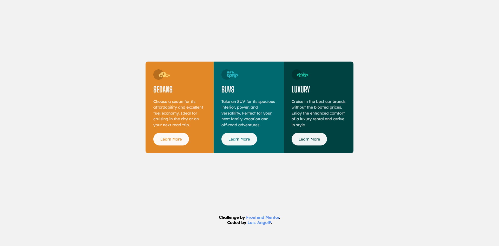

# Frontend Mentor - 3-column preview card component solution

This is a solution to the [3-column preview card component challenge on Frontend Mentor](https://www.frontendmentor.io/challenges/3column-preview-card-component-pH92eAR2-). Frontend Mentor challenges help you improve your coding skills by building realistic projects. 

## Table of contents

- [Overview](#overview)
  - [Screenshot](#screenshot)
  - [Links](#links)
- [My Process](#my-process)
  - [Built with](#built-with)
  - [Useful resourses](#useful-resources)
- [Author](#author)

## Overview

### Screenshot

### Links
- Live Site URL: [Netlify](https://luxury-yeot-d5585c.netlify.app)

## My Process

### Built with

- Semantic HTML5 markup
- Css custom properties
- Flexbox
- Mobile-first workflow

### Useful Resources

- [Reset CSS](https://meyerweb.com/eric/tools/css/reset/) - This helped me for reset default styles of css

## Author

- Frontend Mentor - [@Luis-AngelF](https://www.frontendmentor.io/profile/Luis-AngelF)